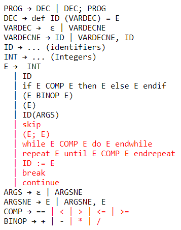
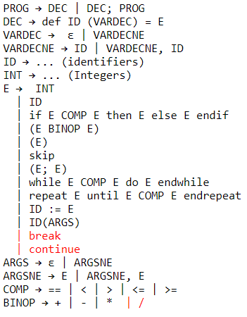
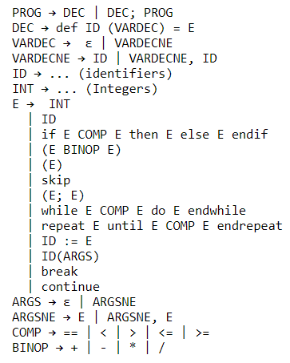

Code generators for a context free grammar. The language is represented by ASTs and the target language is RISC-V machine code.

For each task, further implementation was requried. Everything in red could be ignored for that task.

    Context Free Grammar Task 1
  

    Context Free Grammar Task 2
  

    Context Free Grammar Task 3
  

